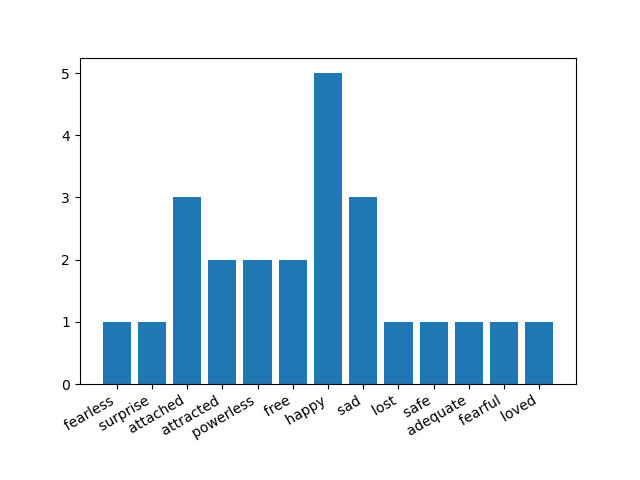
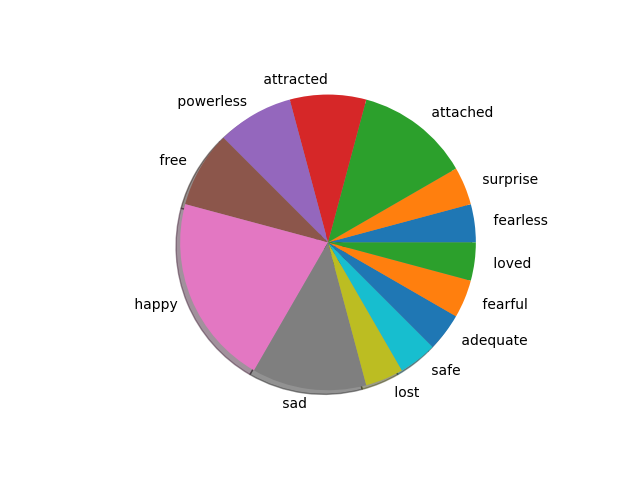

# Emotional analysis of tweets

This is a Python program that performs sentiment analysis on tweets collected from Twitter using the Twitter API. The program analyzes the sentiment of the tweets and generates graphs to display the emotions and sentiments of the tweets.

## Requirements

* Python 3
* tweepy module
* vaderSentiment module
* nltk module
* matplotlib module

## Setup

1. Clone the repository to your local machine.
2. Install the required modules by running `pip install -r requirements.txt` in the command line.
3. Create a Twitter Developer account and get your API keys and access tokens.
4. Replace the `consumer_key`, `consumer_secret`, `access_token`, and `access_token_secret` values in the `twitter_credentials.py` file with your own API keys and access tokens.
5. Run the `twitter_sentiment_analysis.py` file to collect and analyze the tweets.

## Output

The program generates two graphs:

1. A bar graph that displays the count of each emotion detected in the tweets.
2. A pie chart that displays the percentage of positive, negative, and neutral sentiments detected in the tweets.

The graphs are saved in the current directory as `graph.png` and `pie.png`.

## Example

## Credits

* [Tweepy](http://www.tweepy.org/)
* [VADER Sentiment Analysis](https://github.com/cjhutto/vaderSentiment)
* [NLTK](https://www.nltk.org/)
* [Matplotlib](https://matplotlib.org/)
* [Emotion Lexicon](https://saifmohammad.com/WebPages/NRC-Emotion-Lexicon.htm)
